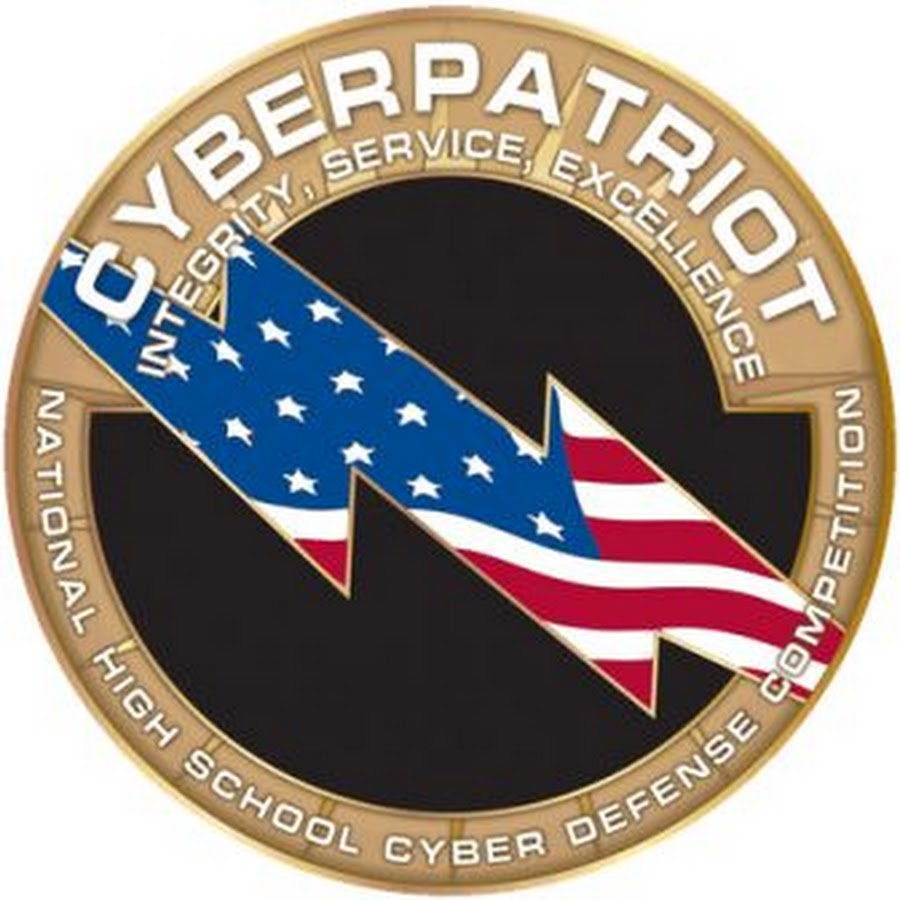

CyberPatriot is a national cyber security competition, run by the United States Air Force. High school students from across the country to compete in a cyber defense test. Teams are given multiple virtual images of different operating systems, specifically Windows, Windows Server, and Ubuntu, and are tasked with finding and fixing any issues, viruses, and vulnerabilities. The competition ran for 6 hours straight for each session and required students to work efficiently for long periods of time.

I participated in the competition during my junior and senior year of high school and mainly worked with Ubuntu. Much of the scoring was based on how many hidden objectives were completed within the given time period. A variety of things were required, like performing OS updates, cleaning out viruses and trojan horses, checking network ports, and finding and uninstalling unnecessary software. While it does take up a lot of time, specifically with long, extended sessions, it is a great opportunity to learn how to navigate different operating systems, as well as where and how to locate viruses and vulnerabilities.

[CyberPatriot Website](https://www.uscyberpatriot.org/)
