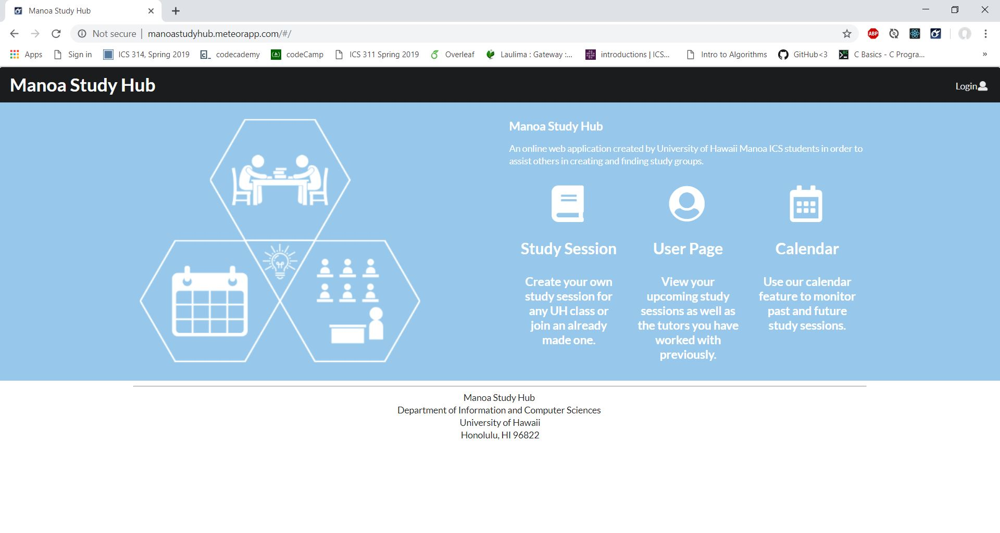

Manoa Study Hub is a group website project for UH Manoa's ICS 314 course. The website allows for students to easily plan study sessions with other students in the same class or with the same major. The website was made with IntelliJ Idea, using CSS, semantic UI, and React, and deployed as a Meteor App. The website itself is honestly quite bare-bones, but implements a few complicated things, specifically dealing with the multiple collections and the calendar. 

This project was a great learning experience for understanding how to work on larger projects as part of a group, as well as to understand the processes of creating a website, nearly from scratch. It really helped me to learn the importance of planning things early on, as well as, how necessary good communication is. The idea of issue-driven management is a great way to keep the project moving along and I would recommend it to be used with any group project. While I was able to complete my share of the work, I do wish I did more as many other improvements can be made to the website, specifically with the styling and aesthetics. 

The documentation and website can be found [here.](https://manoastudyhub.github.io/)
